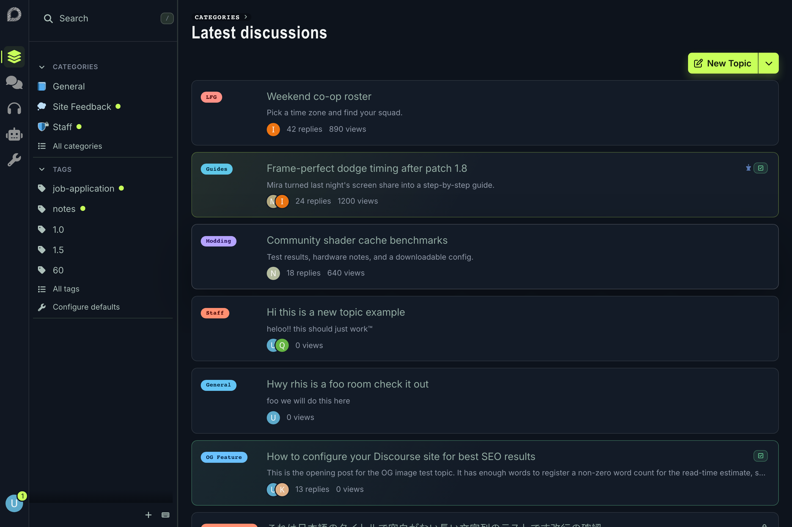
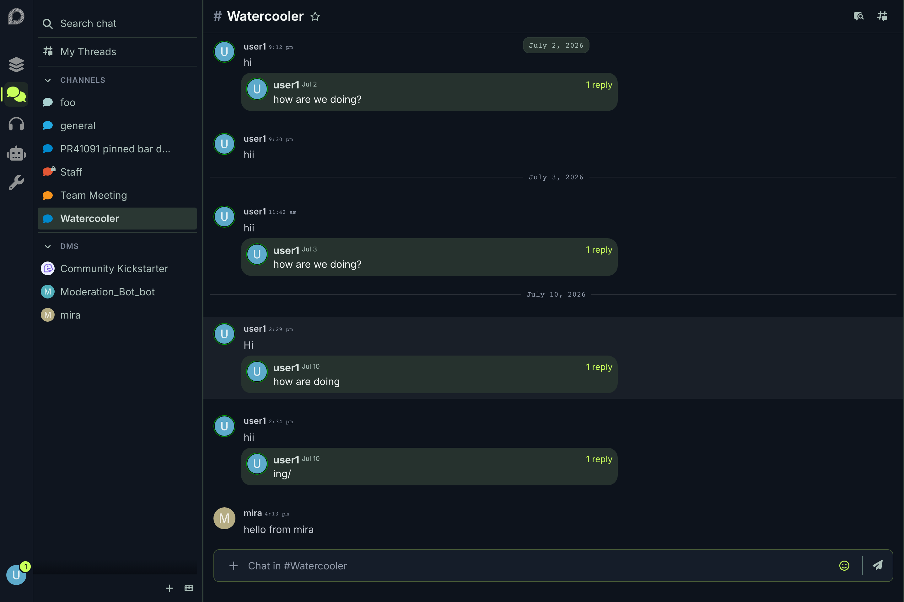
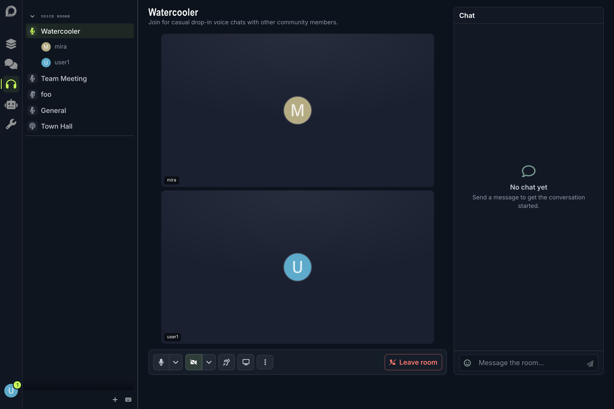
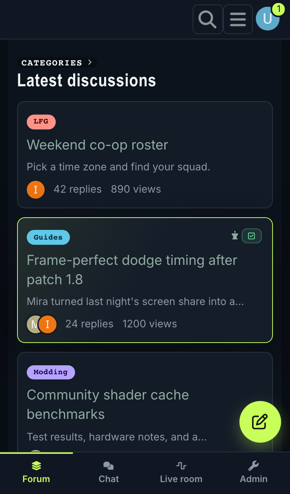

# Resenha Gaming

A dark-first Discourse theme for gaming communities running the [Resenha](https://resenha.falco.dev/) voice-rooms plugin. It turns the forum, chat, and live voice rooms into one workspace: a slim navigation rail on desktop, a context-aware sidebar, card-style topic lists, full-page chat, and a bottom tab bar on mobile.

Based on the design at <https://resenha.falco.dev/>.

## Screenshots

### Forum

### Chat

### Voice room

### Mobile

## Features

- **Nav rail** — on viewports 40rem and up, the site header becomes a 52px full-height rail on the inline-start edge: logo on top, workspace icons under it, and the user menu pinned to the bottom. Menus and dropdowns open beside the rail. Core stays untouched; the rail is pure theme CSS plus a handful of plugin-API hooks.
- **Settings-driven rail items** — the `rail_nav_items` theme setting defines the workspace icons (name, icon, and URL each). Defaults: Topics, Chat, Voice, and AI bot. A blank URL on the Voice item links to the most active voice room; admins additionally get a wrench item for the admin area.
- **Sidebar search row** — forum search leads the sidebar, mirroring chat's "Search chat" row; the `/` shortcut goes to the full search page.
- **Context-aware sidebar** — the forum shows categories and tags, chat shows channels and direct messages, and voice rooms show the room list with live participants.
- **Card topic lists** — category chip, title, excerpt, poster avatars, and reply/view counts on every discovery and profile list; pinned topics get a featured treatment and solved topics a success-tinted edge.
- **Full-page chat** — chat always opens full page with a single-pill composer and quiet separators.
- **Voice rooms** — a call-control rail, presenter layout styling, and a room chat panel that opens via the Voice rail item.
- **Mobile bottom tab bar** — below 40rem the classic top bar returns and the workspace modes move to a fixed bottom navigation bar with safe-area support; chat's own bottom nav stacks neatly above it, and "New topic" becomes a floating action button.

## Theme settings

- `rail_nav_items` — the rail's workspace items, in order. Each item has a name (tooltip/accessible label), an icon, and a URL. Leave the URL blank to link to the most active voice room.
- `rail_nav_extra_icons` — icon names used by the rail items; any icon referenced in `rail_nav_items` must be listed here so it is compiled into the icon sprite.

## Requirements

- A recent Discourse (this theme relies on modern core APIs: topic-list transformers, `light-dark()` color tokens, the `lib/viewport` breakpoint mixins, and `objects`-type theme settings).
- The **Resenha** plugin, installed and enabled (`resenha_enabled: true`).
- **Chat** enabled (`chat_enabled: true`) for the Chat rail item, full-page chat, and room chat.
- Optional: **discourse-ai** — the default AI bot rail item links to its conversations page; remove the item if the plugin isn't installed.
- Optional: **discourse-solved** — solved topics get their badge and card treatment automatically when the plugin is present.

## Installation

Install like any Discourse theme from a git repository:

1. Go to **Admin → Customize → Themes → Install → From a git repository**.
2. Enter this repository's URL and install.
3. Set the theme as default (or user selectable) and pick the **Resenha Night** color scheme for the intended appearance. **Resenha Day** ships as a deliberate cream alternative.

## Recommended site settings

- `resenha_video_enabled: true` — shows the camera and screen-share controls in the call rail.

The Voice rail item navigates with `?chat=true` on desktop-sized viewports, so the room chat panel opens alongside the call; share room links with that query param to give others the same view.

## License

MIT
